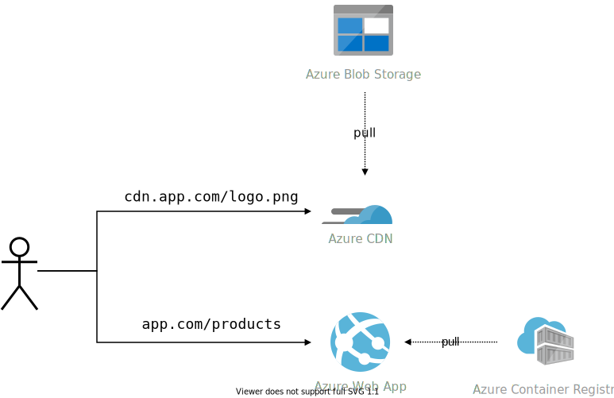

# azure-nodejs-demo

Containerized Node.js Demo App for Azure App Service. 

| Status | Pipeline | Website URL | CDN Endpoint |
|:--|:--|:--|:--|
| [?branchName=main)](https://dev.azure.com/julie-msft/public-demos/_build/latest?definitionId=36&branchName=main) | [dev.yaml](./azure-pipelines/dev.yaml) | [azure-nodejs-demo-dev.azurewebsites.net](https://azure-nodejs-demo-dev.azurewebsites.net/) | [nodejsdemo-dev.azureedge.net](https://nodejsdemo-dev.azureedge.net/css/styles.css) |
| [?branchName=production)](https://dev.azure.com/julie-msft/public-demos/_build/latest?definitionId=37&branchName=production) | [production.yaml](./azure-pipelines/production.yaml) | [azure-nodejs-demo.azurewebsites.net](https://azure-nodejs-demo.azurewebsites.net/) | [nodejsdemo-prod.azureedge.net](https://nodejsdemo-prod.azureedge.net/css/styles.css) |

Note: the `dev.yaml` pipeline generally "partially" fails because of security vulnerabilities found when running `npm audit`. Personally I allow the pipeline to continue and I'm not super concerned because these are only used for local development, e.g. watchers and hot reload.

The `production.yaml` pipeline only checks for non-development dependency vulnerabilities. And that's usually passing and green :)

## Architecture 

This demo leverages the [Static Content Pattern](https://docs.microsoft.com/en-us/azure/architecture/patterns/static-content-hosting) in Cloud Architecture.

The images and CSS can be served from app itself or pulled from external host, e.g. CDN via `ASSETS_BASE_URL` environment variable.



## Real-World CI/CD Pipelines 

In real life you have more than one environment.

- **Azure Pipelines Best Practices** 
  - CI pipeline for feature branches and `main`
  - Deploy when pushing to `main` or `production` branches
  - See [./azure-pipelines](./azure-pipelines) for working pipelines and details

- **Asset Pipeline**  
  The included cd.yaml pipeline shows how to upload assets to Blob Storage and purge the Azure CDN cache as part of your deployment process.

- **CI/CD & Versioning**  
  Example versioning and promotion strategies leveraging git commit messages, git tags and `package.json`.

## Azure Demo

- **Azure PaaS**  
  This app is hosted on [Web App for Containers](https://azure.microsoft.com/en-us/services/app-service/containers/)

- **Azure App Insights integration**  
  Using [appinsights npm package](https://www.npmjs.com/package/applicationinsights) and Express.js middleware with just a few lines of code. See [monitor.js](./app/middleware/monitor.js)


## Endpoints

| Method | Path | Description |
|:--|:--|:--|
| GET | `/` | root |
| GET | `/health` | health check endpoint |
| POST | `/webhooks/test` | accepts JSON and logs output |

### Healthcheck

This is an example healthcheck endpoint with standardized JSON per draft [IETF standard](https://tools.ietf.org/html/draft-inadarei-api-health-check-04)

```json
{
  "status": "pass",
  "version": "0.7.1",
  "details": {
    "uptime": {
      "component_type": "system",
      "observed_value": 24208698,
      "human_readable": "0 days, 6 hours, 43 minutes, 28 seconds",
      "observed_unit": "ms",
      "status": "pass",
      "time": "2021-04-12T11:45:32.508Z"
    },
    "env": {
      "WEBSITE_HOSTNAME": "azure-nodejs-demo-dev.azurewebsites.net",
      "WEBSITE_INSTANCE_ID": "03e7481d3d5ff1e67e297f158abd943ce8c8b920fa55dc7bf0565e86886404a8",
      "ASSETS_BASE_URL": "https://nodejsdemo-dev.azureedge.net"
    }
  }
}
```

## Local Docker Development

Note: in local development, I tend to reference the image sha256. But for the docs, we'll leverage a custom tag `azure-nodejs-demo` to make this doc easier to follow.

### Build Image

```bash
docker build --tag azure-nodejs-demo .
```

### Run Image

To ensure it runs locally, we need to change the default `NODE_ENV` to disable `https://` redirect. Otherwise browser throws insecure connection message and will not load page.

```bash
docker run -it -p 3000:3000 -e NODE_ENV=development azure-nodejs-demo
```

### Target Platform (Edge Case)

In general, **you should _never_ publish local builds**. In case you decide to do this (I was debugging some Azure Container Registry behavior ;-)) from an m1 Mac, you need to specify Linux as the target platform.

```
docker build --platform linux/amd64  .
```