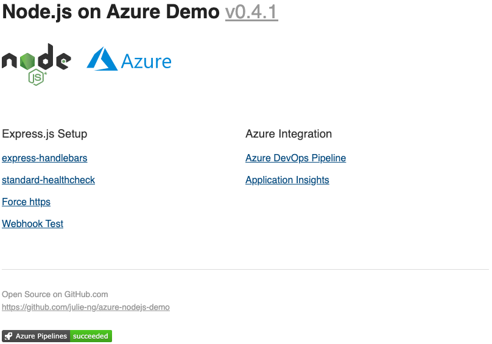

# azure-nodejs-demo

Containerized Node.js Demo App for Azure incl. CI/CD pipeline

## CI/CD Triggers

| Environment | git branch | URL |
|:--|:--|:--|
| Dev | `master` | [nodejs-demo-dev.onazure.io](https://nodejs-demo-dev.onazure.io/) |
| Production | `release` | [nodejs-demo.onazure.io](https://nodejs-demo.onazure.io/) |

## Preview

## Endpoints

| Method | Path | Description |
|:--|:--|:--|
| GET | `/` | root |
| GET | `/health` | health check endpoint |
| POST | `/webhooks/test` | accepts JSON and logs output |

## Features

### Azure 

- [Azure DevOps Pipeline](https://azure.microsoft.com/en-us/services/devops/pipelines/)
- [Azure Application Insights](https://docs.microsoft.com/en-us/azure/azure-monitor/app/app-insights-overview) Integration as middleware [&rarr;](https://github.com/julie-ng/azure-nodejs-demo/blob/master/app/middleware/monitor.js)

### Node.js

- [Handlebars Templates](http://handlebarsjs.com/)
- Force https middleware
- Webhook Path